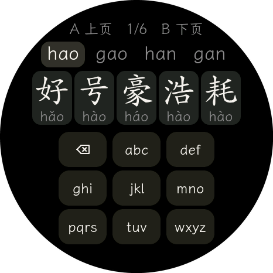
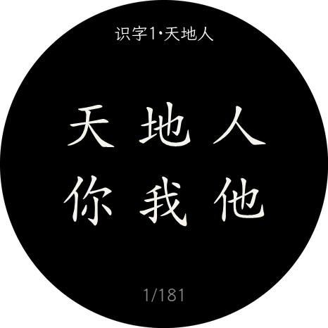
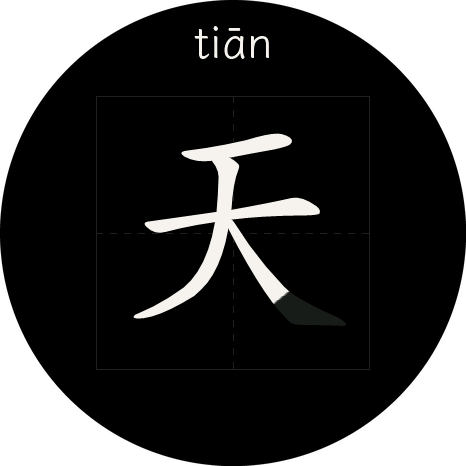
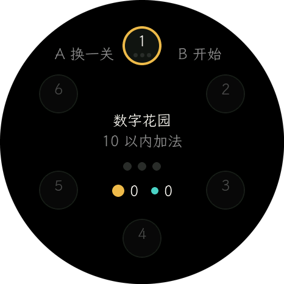
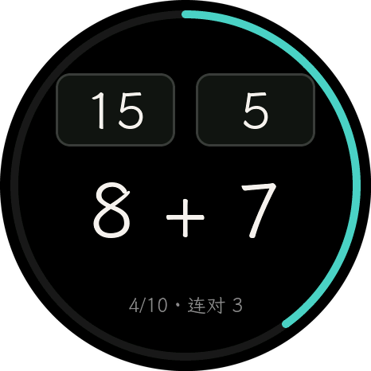
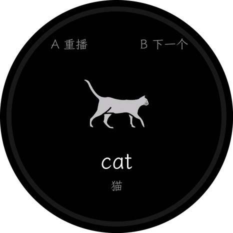
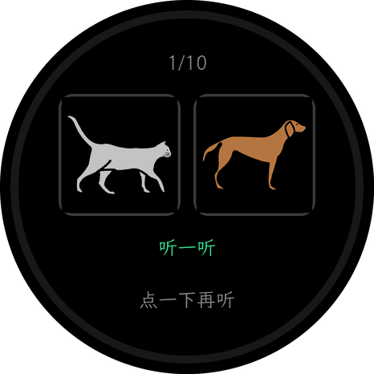

# M5StopWatch-Kids

给小朋友的学习机固件，跑在 M5Stack StopWatch（ESP32-S3，466×466 圆形触摸 AMOLED）上。开机进入首页，左右滑动在三个 App 之间选择：

| App | 内容 |
|---|---|
| **识字** | 拼音查字 + 笔顺动画：9562 字（教材 1847 字按课文编排 + 笔画数据全集），滚筒拼读 / 字母拨盘 / T9 三种输入横滑切换（状态随切换携带），田字格里逐笔写给孩子看，配带声调拼音 |
| **算术** | 100 以内加减法二选一闯关，六档难度自适应，星尘经济 + 关卡地图 |
| **英语** | 给还不识字的孩子看图听音学单词，24 组 288 词，图卡过一遍再二选一 |

从 `M5StopWatch-UserDemo` 派生的精简版：去掉了表盘、秒表、徽章、IMU、频谱、WiFi 配网等全部无关功能，只保留左右滚动的 launcher 和这三个 App。

三个 App 各自的设计说明：**[识字](main/apps/app_hanzi/README.md)** · **[算术](main/apps/app_math/README.md)** · **[英语](main/apps/app_english/README.md)**。

## 长什么样

下面每一张都是 `*_sim` 用**真正的 view 代码 + 真正的数据**在主机上渲染出来的，圆内和设备上逐像素一致。

屏幕是圆的，所以图也是圆的：sim 按 r=233 遮罩后写进 PPM，而 PPM 没有 alpha 通道、圆外只能填黑，`tools/make_readme_shots.py` 再把同一个圆抠成 alpha，这样放在什么底色上它都还是一块圆玻璃。重新生成：

```bash
python3 tools/make_readme_shots.py     # 跑三个 sim，挑图，抠圆，写进 docs/images/
```

<table>
<tr>
<td align="center"><br><sub><b>识字</b> · 滚筒拼读查字</sub></td>
<td align="center"><br><sub><b>识字</b> · 按课文分页浏览</sub></td>
<td align="center"><br><sub><b>识字</b> · 田字格里逐笔写</sub></td>
</tr>
<tr>
<td align="center"><br><sub><b>算术</b> · 六档关卡地图</sub></td>
<td align="center"><br><sub><b>算术</b> · 二选一，环显示连对</sub></td>
</tr>
<tr>
<td align="center"><br><sub><b>英语</b> · 图卡，自动读三遍</sub></td>
<td align="center"><br><sub><b>英语</b> · 听音选图</sub></td>
</tr>
</table>

## 操作

硬件只有 A、B 两个键，加一块触摸屏。两个键像耳朵一样长在表壳的 **10 点和 2 点方向**（距正上方约 ±41°）。

由此来的一条硬规矩，三个 App 都遵守：**按键引导放在它对应的那个按键正下方，按键选中的东西也放在按键正下方**。所以算术的答案卡在 `(±88, -95)`、英语的图卡在 `(±84, -40)`——「按左边的耳朵」和「选左边那张」在空间上是同一个动作。A、B 两条引导并作一行摆在屏幕底部是不行的，底部那行谁也没指。

| | 首页 | 识字·搜索 | 识字·浏览 | 识字·学习 | 算术·地图 | 算术·答题 | 算术·结算 | 英语·选组 | 英语·图卡 | 英语·答题 | 英语·结果 |
|---|---|---|---|---|---|---|---|---|---|---|---|
| **A 键** | 上一个 App | 汉字滚筒上拨一格² | 上一页 / 上一课 | 上一个字¹ | 换一关 | 选左边 | 再来一关 | 换一组 | 重播 | 选左边 | 再来一次 |
| **B 键** | 下一个 App | 汉字滚筒下拨一格² | 下一页 / 下一课 | 下一个字¹ | 开始 | 选右边 | 地图 | 开始 | 下一个 | 选右边 | 换一组 |
| **点击** | 图标 → 进入 | 点选中带选字 / 拨滚筒² | 选字 → 学习页 | 整屏重播动画 | 选关卡 / 中心开始 | 点卡片作答 | 再来一关 | 选中 / 开始 | 整屏重播 | 点那张图 | 推进 |
| **横滑** | — | 切换输入模式² | → 搜索页 | — | — | — | — | — | — | — | — |
| **A+B 长按** | — | 回首页 | 回搜索页 | 回来处 | 回首页 | 回首页 | 回首页 | 回首页 | 回选组 | 回选组 | 回选组 |

¹ 从搜索进入学习页时，A/B 变为「返回搜索 / 重写一遍」——搜出来的字没有有意义的"下一个"。

² 搜索页有三种拼音输入模式（滚筒拼读 / 26 字母拨盘 / T9 九宫格），大范围横滑循环切换，输入状态随切换携带，选择记在 NVS；表内写的是默认的滚筒模式，拨盘和 T9 下 A/B 是候选翻页、点击是输入字母（键）和点候选选字。

进度存在 NVS 里，三个 App 各占一个命名空间：`hanzi`（学到第几个字）、`math`（难度档、星尘、星星、解锁进度）、`english`（每组几颗星），重新开机接着上次。

## 护眼

屏幕是 AMOLED，黑色像素是真的不发光，所以三个 App 都是纯黑底：整屏发光面积压在 20% 以下。字号给得很大（算式 96 px、答案 64 px、笔画格 300 px、英语图卡 144 px），孩子不用凑近看。

答题过程中只有静态的配色变化，没有任何闪烁或快速位移；动画集中在结算页那不到三秒的庆祝里。

## 构建

需要 [ESP-IDF v5.5](https://docs.espressif.com/projects/esp-idf/en/v5.5/esp32s3/index.html)。`components/` 被 gitignore，克隆后第一步先把第三方组件拉下来：

```bash
python3 ./fetch_repos.py     # 拉取 M5GFX / LVGL / mooncake 等，并打上 patches/
idf.py build
idf.py -p <PORT> flash monitor
```

改动或新增源文件后需要 `idf.py reconfigure`——`main/CMakeLists.txt` 用 `file(GLOB_RECURSE)` 按 App 分组收集源文件，不重新配置就感知不到文件增删。

## 按需构建：只装你要的 App

三个 App 可以在构建期单独开关：

```bash
idf.py menuconfig          # → Kids firmware → 勾掉不要的 App
idf.py reconfigure && idf.py build
```

也可以写进 `sdkconfig.defaults` 固化档位，例如只出英语版：

```
CONFIG_KIDS_APP_HANZI=n
CONFIG_KIDS_APP_MATH=n
CONFIG_KIDS_APP_ENGLISH=y
```

关掉一个 App，它的**代码和数据一起消失**——blob、字体、图标都不再进固件。各 App 独占的数据：

| App | 独占数据 | 大小 |
|---|---|---|
| 识字 | `hanzi_data.bin` | 7.86 MB |
| 英语 | `english_data.bin`（24 组 / 40 组全量） | 4.11 MB / 7.03 MB |
| 算术 | 两个数字字体 | < 0.2 MB |
| 识字 · 英语 共享 | 拼音字体 | 任一个在就在 |
| 全员共享 | 界面中文字体 `lv_font_hanzi_ui_24` | 永远在 |

**只留一个 App 时 launcher 会被整个去掉**，开机直接进那个 App。相应地「A+B 长按回首页」变成无操作——没有首页可回，关掉唯一的 App 只会剩一块黑屏，没人重开它。

一个都不选会在 CMake 阶段直接报错，不会构建出一个空壳固件。

> 英语还有另一个正交的裁剪维度：仓库里存着全部 480 词，固件只打包前 N 组（`--pack-units N`，当前 24 组）。见 [英语 App 的 README](main/apps/app_english/README.md)。

## 主机测试

三个 App 的逻辑层都不含 LVGL / ESP-IDF 头，可以直接在主机上跑。**改完 UI 先跑这些再上板**——它们抓得到肉眼在真机上看不出来的问题：

```bash
# 识字：全字形与 golden 逐像素 diff、动画增量重绘残影检测、真 LVGL UI 模拟器
cmake -S tools/hanzi_host_test -B build_host && cmake --build build_host
./build_host/hanzi_host_test            # 9562 字逐字与 golden 比对
./build_host/anim_host_test --char 6211 # 每帧比对增量绘制 vs 全量重绘，抓脏区/残影
./build_host/hanzi_sim

# 算术：600 万道题的不变量断言 + 干扰项可归因性统计
cmake -S tools/math_host_test -B build_math && cmake --build build_math
./build_math/math_logic_test
./build_math/math_sim --out /tmp/mathshots

# 英语：直接读固件真正链接的那个 blob
cmake -S tools/english_host_test -B build_english && cmake --build build_english
./build_english/english_logic_test
./build_english/english_sim --out /tmp/engshots
```

三个 `*_sim` 编译的都是**真正的 view .cpp**，除了出截图还会断言：**没有任何点亮的像素落在半径 233 的圆外**。屏幕是圆的，方形思维下排好的布局很容易在四角溢出玻璃，这个检查把它变成非零退出码，而不是靠肉眼看截图——截图是圆形遮罩后的，出界的部分从 PPM 里根本看不到。

极端用例都**从真实生成路径里采样**，不是手捏的：`math_sim` 采样几十万道真题取最宽的算式，`english_sim` 逐词渲染 288 个词、检查每张图的点亮率落在 3%–97%（全黑=没画出来，全亮=palette 或 stride 错了），并自动挑出渲染最宽的词和释义去测极端布局。

## 分区

不联网，所以没有 OTA 双分区，全部空间给固件和数据。默认布局 `partitions.csv`：

```
nvs       24 KB
phy_init   4 KB
factory  15.9 MB    固件 + 内嵌字库 + 各 App 的数据
```

原先这里还有一个 4.9 MB 的 `storage` FAT 分区，但固件从来没有读写过 `/spiflash`，所以那块空间划给了 `factory`。真要用文件系统，在 `idf.py menuconfig` → Partition Table → Custom partition CSV file 里换成 `partitions-with-storage.csv` 即可，**代码不用动**：`hal_fs.cpp` 启动时探测分区在不在，不在就跳过挂载。

## 数据

三个 App 的内容都不是手写的，是 `tools/` 下各自的管线生成的。生成好的数据已经在版本库里，**克隆下来直接 `idf.py build` 就行**，不联网、不需要配置任何东西。下面这些只有在你要改数据的时候才用得上。

| 内容 | 来源 | 怎么配 |
|---|---|---|
| 笔顺 | [hanzi-writer-data](https://github.com/chanind/hanzi-writer) → 派生自 [Make Me a Hanzi](https://github.com/skishore/makemeahanzi)，字形来自 Arphic PL 字体（Arphic Public License） | 有默认值，`$STROKE_URL` 可覆盖 |
| 字表与拼音 | [vipzhicheng/shukong-app](https://github.com/vipzhicheng/shukong-app) 整理的小学语文教材数据（MIT） | 有默认值，`$BOOK_URL` 可覆盖 |
| 英语图片 | [ARASAAC](https://arasaac.org) 开放 AAC 图库，REST API 无需 key，图片 id 逐词钉死在 `wordlist.py` | 有默认值，`$PICTO_API` 可覆盖 |
| 英语发音 | 本机的词典 mdd/mdx | **没有默认值**——这是你机器上的路径，`--dict-mdd` / `$DICT_MDD` |
| 界面字体 | [霞鹜文楷 LXGW WenKai](https://github.com/lxgw/LxgwWenKai)（SIL OFL），小学课本用楷体，且与笔顺数据的字形风格一致 | 放进 `tools/hanzi_pipeline/.cache/fonts/`，或 `$UI_FONT` |

除了词典那一条，其余都能照着默认值原样重跑出来。发音缺了不影响构建——那些词只是静音出货。

各管线的细节见 [识字](main/apps/app_hanzi/README.md) 和 [英语](tools/english_pipeline/README.md) 的 README。
